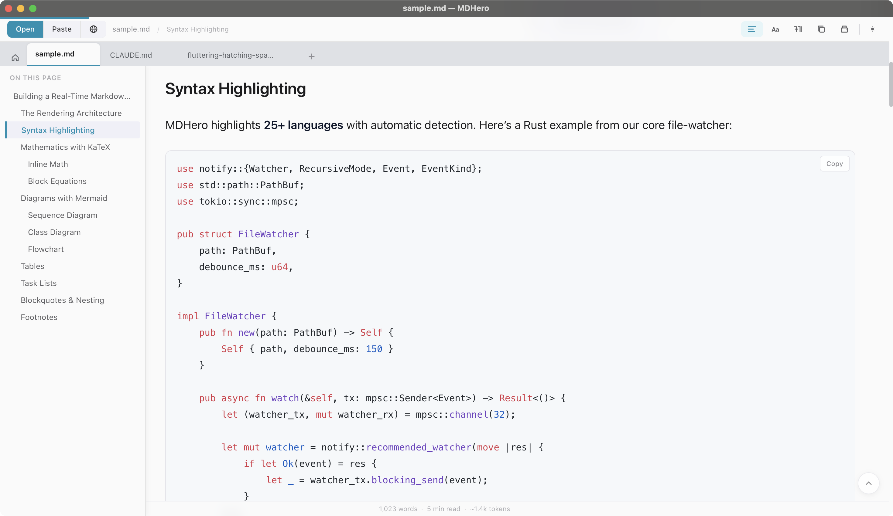
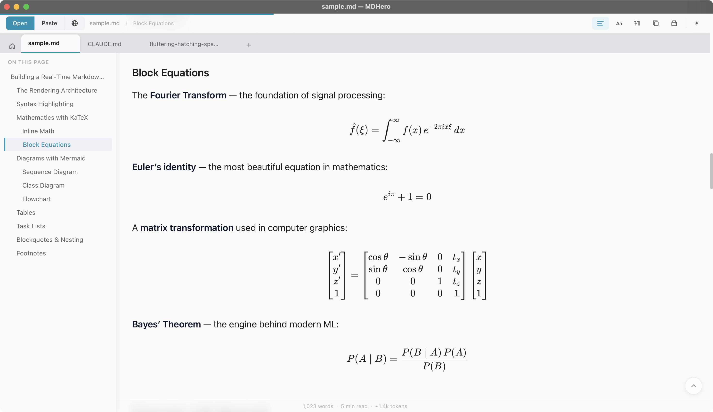
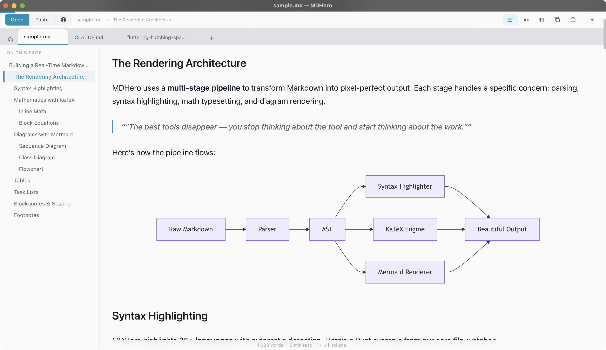
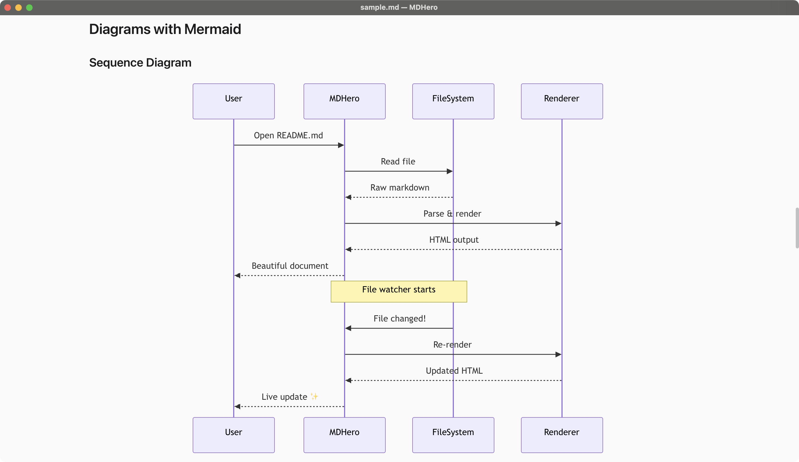

<div align="center">

# MDHero

A beautiful, native Markdown viewer and lightweight editor for macOS and Windows. ~11MB. Free. Open source.

[](https://github.com/vaibhavuk-dev/mdhero/stargazers)
[](https://github.com/vaibhavuk-dev/mdhero/releases/latest)
[](LICENSE)


[](https://tauri.app)

[Download](https://github.com/vaibhavuk-dev/mdhero/releases/latest) · [Website](https://mdhero.app) · [Discussions](https://github.com/vaibhavuk-dev/mdhero/discussions)

</div>

<table>
<tr>
<td></td>
<td></td>
</tr>
<tr>
<td align="center"><em>Light mode</em></td>
<td align="center"><em>Dark mode</em></td>
</tr>
</table>

Open local `.md` files, paste AI-generated markdown, or fetch from any public URL — and read or edit it the way it was meant to be.

---

## Why MDHero

Markdown is where developers, writers, and AI live today — READMEs, Claude Code plans, LLM chat exports, notes, documentation. But opening a `.md` file in a code editor gives you ugly monospace text. Opening a web-based viewer means uploading your files. GitHub renders it beautifully but only if the file is in a repo.

**MDHero is a native app for everything in between.** Your files stay local. Rendering is instant. Edit in place when you need to. Works offline. Looks like it belongs on your machine.

---

## Features

### Reading
- **Beautiful rendering** — Apple-inspired typography, light & dark themes
- **Syntax highlighting** — 25+ languages via highlight.js
- **Math & diagrams** — KaTeX for equations, Mermaid for flowcharts
- **Reader controls** — adjust font, size, line height, width
- **Zen mode** — distraction-free full-screen reading
- **Print/Export to PDF** — with clean print styles

### Editing (v0.2.0)
- **Lightweight in-app editor** — `Cmd+E` flips any local file into edit mode
- **Save with `Cmd+S`** — writes back to disk; the file watcher knows it was you and skips the reload
- **Stays where you were** — source-line scroll sync keeps your position across viewer ↔ raw ↔ edit
- **Dirty indicator** — `•` in the tab title and toolbar when you have unsaved changes
- **Per-tab edit state** — switch tabs and back; your edits are right where you left them

### Navigation
- **Multiple tabs** — open many files, drag to reorder, Cmd+1–9 to switch
- **Table of Contents** — auto-generated sidebar with active heading tracking
- **Search (Cmd+F)** — with match highlighting
- **Vim keys** — j/k/gg/G/d/u/[/] for keyboard-first navigation
- **Image lightbox** — click to zoom, arrow keys for next/prev

### Opening Files
- **Local files** — drag-drop, Cmd+O, "Open With" from Finder
- **Pinned folders** — quick access to markdown in your favorite directories
- **Claude Code Plans** — auto-discovers `~/.claude/plans/`
- **Open URL** — fetch from GitHub, Gist, GitLab, Bitbucket, or any public URL
- **Paste mode (Cmd+Shift+V)** — render LLM output instantly, auto-unescapes `\n`
- **Recent files** — pick up where you left off, with reading progress per file

### Live
- **File watching** — edit in VS Code, see updates instantly in MDHero
- **Auto-reload** — survives atomic saves (VS Code, vim, etc.)

### Sharing
- **Copy as Rich Text** — paste directly into Google Docs, Notion
- **Copy as Markdown** — raw source
- **Export PDF** — print-friendly output

---

## Screenshots

### Syntax Highlighting

25+ languages with automatic detection, copy button, and clean typography.



### Math Rendering (KaTeX)

Render LaTeX equations instantly — from inline math to full block equations and matrices.



### Mermaid Diagrams

Flowcharts, sequence diagrams, class diagrams, and more — rendered natively.



### Zen Mode

Distraction-free full-screen reading. Just you and the document.



---

## Install

**macOS**: Download `.dmg` from [Releases →](https://github.com/vaibhavuk-dev/mdhero/releases/latest)

**Windows**: Download `.msi` from [Releases →](https://github.com/vaibhavuk-dev/mdhero/releases/latest)

Or build from source (see below).

---

## Keyboard Shortcuts

| Shortcut | Action |
|---|---|
| `Cmd+O` | Browse files |
| `Cmd+Shift+V` | Paste markdown |
| `Cmd+T` | New tab (home) |
| `Cmd+W` | Close tab (confirms if unsaved edits) |
| `Cmd+1..9` | Switch to tab N |
| `Cmd+F` | Find in document |
| `Cmd+E` | Toggle edit mode |
| `Cmd+S` | Save edits to disk |
| `Cmd+U` | Toggle raw markdown view |
| `Cmd+Shift+F` | Zen mode |
| `Cmd+=` / `Cmd+-` | Zoom in / out |
| `Cmd+0` | Reset zoom |
| `j` / `k` | Scroll down / up |
| `gg` / `G` | Jump to top / bottom |
| `[` / `]` | Previous / next heading |
| `/` | Open search |

Cmd → Ctrl on Windows/Linux.

---

## Development

```bash
pnpm install
pnpm tauri dev          # Run dev with hot reload
pnpm tauri build        # Production build (outputs DMG/MSI)
pnpm check              # TypeScript check
```

**Requirements:** Node 22+, Rust stable, pnpm 10+.

Port 1420 is used for dev. Kill stale processes with `lsof -ti:1420 | xargs kill -9`.

### Stack

- [Tauri v2](https://tauri.app) — Rust backend, ~11MB binary
- [SvelteKit](https://kit.svelte.dev) — frontend with Svelte 5 runes
- [markdown-it](https://github.com/markdown-it/markdown-it) — rendering pipeline
- [highlight.js](https://highlightjs.org) — syntax highlighting
- [KaTeX](https://katex.org) — math rendering
- [Mermaid](https://mermaid.js.org) — diagram rendering
- [Tailwind CSS v4](https://tailwindcss.com) — styling

---

## Privacy

MDHero runs entirely on your machine.

- **No telemetry.** No analytics. No tracking.
- **No account required.** Use it anonymously.
- **Your files never leave your computer.** Rendering happens locally.
- **Network access** is limited to: checking for new releases (once per 24h) and fetching URLs you explicitly paste into the Open URL feature.

---

## Roadmap

**Coming next:**
- Quick Switcher (Cmd+P fuzzy finder)
- Folder watch (auto-refresh pinned folder contents)
- Export to self-contained HTML
- Presentation mode
- Compare / diff view

---

## Contributing

See [CONTRIBUTING.md](CONTRIBUTING.md) for setup, guidelines, and how to propose changes.

---

## License

MIT © Vaibhav Kakde
