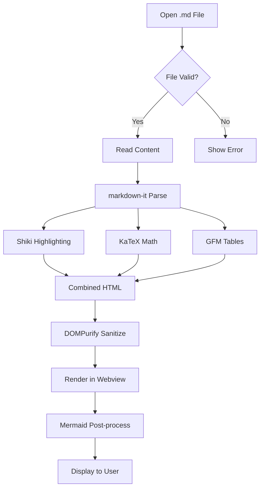
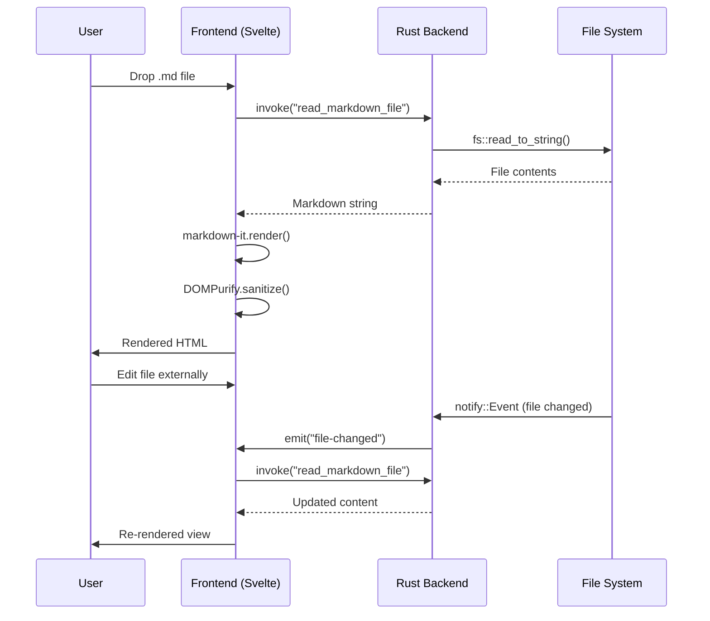
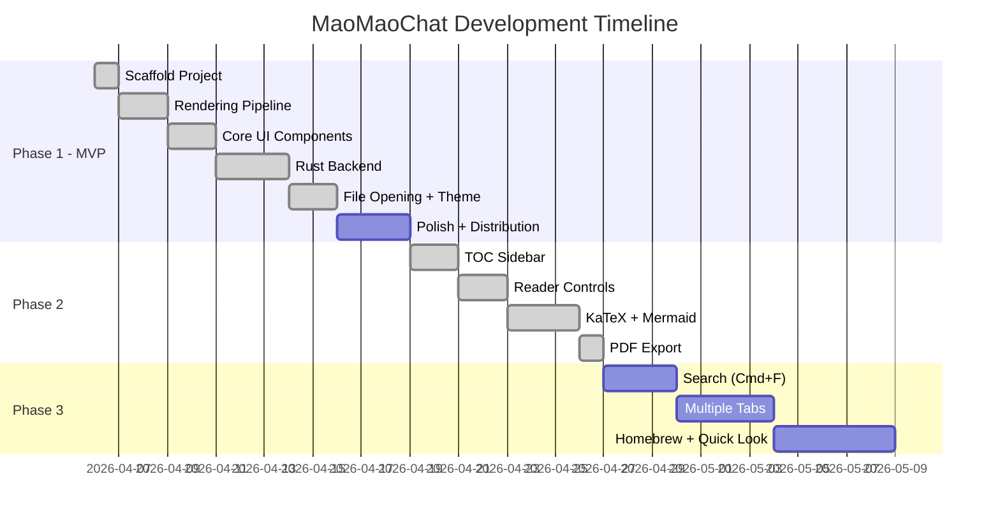

# MaoMaoChat — Complete Rendering Test v1.0.2

> This file tests every rendering feature of MaoMaoChat. If everything below looks beautiful, the app is working correctly.

---

## 1. Text Formatting

**Bold text**, *italic text*, ***bold and italic***, ~~strikethrough~~, and `inline code`.

Here's a [hyperlink](https://github.com) and an autolinked URL: https://example.com

Text with a footnote reference[^1].

[^1]: This is the footnote content.

---

## 2. Headings Hierarchy

### H3 — Third Level
#### H4 — Fourth Level
##### H5 — Fifth Level
###### H6 — Sixth Level

---

## 3. Lists

### Unordered List

- Apple
- Banana
  - Cavendish
  - Plantain
    - Green plantain
    - Ripe plantain
- Cherry

### Ordered List

1. First step
2. Second step
   1. Sub-step A
   2. Sub-step B
3. Third step

### Task List (GFM)

- [x] Set up Tauri v2
- [x] Implement markdown-it pipeline
- [x] Add Shiki syntax highlighting
- [x] Dark mode support
- [x] File watcher (live reload)
- [x] KaTeX math rendering
- [x] Mermaid diagram support
- [ ] Quick Look plugin
- [ ] Homebrew distribution

### Mixed Nested List

1. Fruits
   - [x] Apple
   - [ ] Mango
   - Grape
2. Vegetables
   - Carrot
     1. Orange carrot
     2. Purple carrot
   - Spinach

---

## 4. Code Blocks

### TypeScript

```typescript
interface FileWatcher {
  path: string;
  debounceMs: number;
  onChange: (content: string) => void;
}

async function watchFile(watcher: FileWatcher): Promise<() => void> {
  const { path, debounceMs, onChange } = watcher;
  let timeout: ReturnType<typeof setTimeout>;

  const handler = (event: FileSystemEvent) => {
    clearTimeout(timeout);
    timeout = setTimeout(async () => {
      const content = await readFile(path, "utf-8");
      onChange(content);
    }, debounceMs);
  };

  const unsubscribe = await subscribe(path, handler);
  return unsubscribe;
}
```

### Python

```python
from dataclasses import dataclass
from typing import Optional

@dataclass
class MarkdownDocument:
    path: str
    content: str
    title: Optional[str] = None

    @property
    def word_count(self) -> int:
        return len(self.content.split())

    def render(self, theme: str = "github") -> str:
        """Render markdown to HTML with the specified theme."""
        import markdown
        extensions = ["tables", "fenced_code", "codehilite"]
        return markdown.markdown(self.content, extensions=extensions)

# Usage
doc = MarkdownDocument(path="README.md", content="# Hello World")
print(f"Words: {doc.word_count}")
```

### Rust

```rust
use notify::{Watcher, RecursiveMode, Event};
use std::sync::mpsc;
use std::time::Duration;

fn watch_markdown(path: &str) -> notify::Result<()> {
    let (tx, rx) = mpsc::channel::<Event>();

    let mut watcher = notify::recommended_watcher(move |res| {
        if let Ok(event) = res {
            tx.send(event).unwrap();
        }
    })?;

    watcher.watch(path.as_ref(), RecursiveMode::NonRecursive)?;

    loop {
        match rx.recv_timeout(Duration::from_secs(1)) {
            Ok(event) => println!("File changed: {:?}", event),
            Err(_) => continue,
        }
    }
}
```

### Bash

```bash
#!/bin/bash
# Build and run MaoMaoChat
set -euo pipefail

echo "Building MaoMaoChat..."
pnpm tauri build --target universal-apple-darwin

APP_SIZE=$(du -sh src-tauri/target/release/bundle/dmg/*.dmg | cut -f1)
echo "Bundle size: $APP_SIZE"

if [[ "$APP_SIZE" < "10M" ]]; then
  echo "✅ Size target met!"
else
  echo "⚠️  Bundle exceeds 10MB target"
fi
```

### JSON

```json
{
  "productName": "MaoMaoChat",
  "version": "0.1.0",
  "identifier": "com.maomaochat.app",
  "bundle": {
    "fileAssociations": [
      {
        "ext": ["md", "markdown", "mdown"],
        "mimeType": "text/markdown",
        "description": "Markdown Document"
      }
    ]
  }
}
```

### CSS

```css
article.prose {
  --md-max-width: 720px;
  max-width: var(--md-max-width);
  margin: 0 auto;
  font-family: Inter, system-ui, sans-serif;
}

.dark article.prose {
  color: #e4e4e7;
  background-color: #1a1a2e;
}

@media print {
  article.prose {
    max-width: 100%;
    font-size: 12pt;
  }
}
```

### SQL

```sql
SELECT 
    d.filename,
    d.file_size,
    d.last_opened,
    COUNT(v.view_id) AS total_views
FROM documents d
LEFT JOIN views v ON d.id = v.document_id
WHERE d.extension IN ('md', 'markdown', 'mdown')
  AND d.last_opened > NOW() - INTERVAL '30 days'
GROUP BY d.id
ORDER BY total_views DESC
LIMIT 20;
```

### Diff

```diff
- import { afterUpdate } from "svelte";
+ import { tick } from "svelte";

  $effect(() => {
    html;
-   afterUpdate(() => {
-     renderMermaidBlocks();
-   });
+   tick().then(() => {
+     renderMermaidBlocks();
+   });
  });
```

### Inline Code Variations

Use `pnpm tauri dev` to start development. The config lives in `tauri.conf.json`. Run `cargo build` for the Rust backend.

---

## 5. Tables

### Simple Table

| Feature | Status | Platform |
|---------|--------|----------|
| File Viewer | Done | All |
| Dark Mode | Done | All |
| Live Reload | Done | All |
| KaTeX Math | Done | All |
| Mermaid | Done | All |

### Wide Table (Horizontal Scroll)

| Feature | Description | Tech Stack | Status | Platform | Phase | Priority | Release | Notes |
|---------|-------------|------------|--------|----------|-------|----------|---------|-------|
| Core Viewer | Render .md beautifully | markdown-it + Shiki | Done | macOS, Win, Linux | 1 | P0 | v0.1.0 | Ships first |
| Live Reload | Auto-refresh on file change | Rust notify crate | Done | All | 1 | P0 | v0.1.0 | 300ms debounce |
| Theme Toggle | Light / Dark / System | Tailwind dark mode | Done | All | 1 | P0 | v0.1.0 | OS-aware |
| TOC Sidebar | Heading navigation | IntersectionObserver | Done | All | 2 | P1 | v0.2.0 | Collapsible |
| KaTeX Math | LaTeX rendering | KaTeX + markdown-it-texmath | Done | All | 2 | P1 | v0.2.0 | Inline + block |
| Mermaid | Diagram rendering | Mermaid.js | Done | All | 2 | P1 | v0.2.0 | Post-process |
| PDF Export | Print-friendly output | webview.print() | Done | All | 2 | P1 | v0.2.0 | @media print |
| Quick Look | Finder preview | Swift + WebKit | Planned | macOS | 3 | P2 | v0.3.0 | Separate project |

### Alignment

| Left Aligned | Center Aligned | Right Aligned |
|:-------------|:--------------:|--------------:|
| Left | Center | Right |
| Data | Data | Data |
| More data | More data | 1,234.56 |

---

## 6. Blockquotes

> Simple blockquote with a single line.

> **Nested blockquote with formatting:**
> 
> This paragraph has *italic*, **bold**, and `code` inside a blockquote.
> 
> - List item in blockquote
> - Another item
>
> > Nested blockquote — going deeper.
> >
> > > Three levels deep.

---

## 7. Math (KaTeX)

### Inline Math

The quadratic formula is $x = \frac{-b \pm \sqrt{b^2 - 4ac}}{2a}$ and Euler's identity is $e^{i\pi} + 1 = 0$.

Energy-mass equivalence: $E = mc^2$. The Pythagorean theorem: $a^2 + b^2 = c^2$.

### Block Math

The Gaussian integral:

$$\int_{-\infty}^{\infty} e^{-x^2} dx = \sqrt{\pi}$$

Taylor series expansion:

$$f(x) = \sum_{n=0}^{\infty} \frac{f^{(n)}(a)}{n!}(x-a)^n$$

Maxwell's equations in differential form:

$$\nabla \cdot \mathbf{E} = \frac{\rho}{\varepsilon_0}$$

$$\nabla \cdot \mathbf{B} = 0$$

$$\nabla \times \mathbf{E} = -\frac{\partial \mathbf{B}}{\partial t}$$

Matrix notation:

$$\begin{pmatrix} a & b \\ c & d \end{pmatrix} \begin{pmatrix} x \\ y \end{pmatrix} = \begin{pmatrix} ax + by \\ cx + dy \end{pmatrix}$$

---

## 8. Mermaid Diagrams

### Flowchart



### Sequence Diagram



### Gantt Chart



---

## 9. Images

*Image test: Images render when pointing to a valid local or accessible path.*

`` — works with local file paths and accessible URLs.

---

## 10. Horizontal Rules

Above the rule.

---

***

___

Below the rules. (Three different syntaxes: `---`, `***`, `___`)

---

## 11. HTML Entities & Special Characters

Copyright © 2026 MaoMaoChat. All rights reserved.

Arrows: → ← ↑ ↓ ↔

Em dash — and en dash –

Ellipsis…

Quotes: "smart double" and 'smart single'

Symbols: ± × ÷ ≠ ≤ ≥ ∞ ° µ

---

## 12. Long Paragraph (Reading Comfort Test)

Lorem ipsum dolor sit amet, consectetur adipiscing elit. Sed do eiusmod tempor incididunt ut labore et dolore magna aliqua. Ut enim ad minim veniam, quis nostrud exercitation ullamco laboris nisi ut aliquip ex ea commodo consequat. Duis aute irure dolor in reprehenderit in voluptate velit esse cillum dolore eu fugiat nulla pariatur. Excepteur sint occaecat cupidatat non proident, sunt in culpa qui officia deserunt mollit anim id est laborum.

Curabitur pretium tincidunt lacus. Nulla gravida orci a odio. Nullam varius, turpis et commodo pharetra, est eros bibendum elit, nec luctus magna felis sollicitudin mauris. Integer in mauris eu nibh euismod gravida. Duis ac tellus et risus vulputate vehicula. Donec lobortis risus a elit. Etiam tempor. Ut ullamcorper, ligula ut dictum pharetra, nisi nunc fringilla magna, in commodo elit erat nec turpis. Ut pharetra augue nec augue.

---

## 13. Edge Cases

### Empty Code Block

```
```

### Single-Line Code Block

```
Hello, World!
```

### Very Long Line in Code

```
This is a very long line that should trigger horizontal scrolling in the code block container to test overflow behavior: aaaaaaaaaaaaaaaaaaaaaaaaaaaaaaaaaaaaaaaaaaaaaaaaaaaaaaaaaaaaaaaaaaaaaaaaaaaaaaaaaaaabbbbbbbbbbbbbbbbbbbbbbbbbb
```

### Deeply Nested Blockquote

> Level 1
> > Level 2
> > > Level 3
> > > > Level 4
> > > > > Level 5

### Adjacent Headings

### Heading A
### Heading B
### Heading C

---

*End of test document. If you can read this beautifully, MaoMaoChat is working perfectly.* ✨
