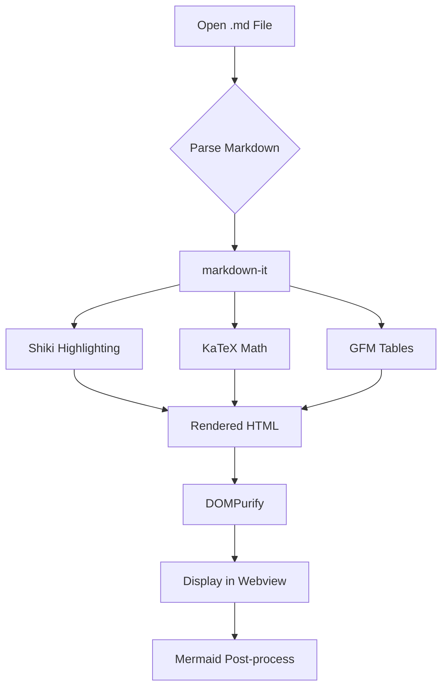

# MDHero Test Document

A beautifully rendered markdown viewer. **Bold**, *italic*, ~~strikethrough~~, and `inline code`.

## Features

- [x] GFM Tables
- [x] Task Lists
- [x] Syntax Highlighting (Shiki)
- [x] Mermaid Diagrams
- [x] LaTeX Math (KaTeX)
- [x] Dark Mode
- [x] Live Reload
- [ ] Quick Look Plugin

## Code Block

```typescript
interface MarkdownViewer {
  open(path: string): Promise<void>;
  render(content: string): string;
  watch(path: string): void;
}

const viewer: MarkdownViewer = {
  async open(path) {
    const content = await readFile(path);
    return this.render(content);
  },
  render(content) {
    return markdownIt.render(content);
  },
  watch(path) {
    notify.watch(path, () => this.open(path));
  },
};
```

```python
def fibonacci(n: int) -> int:
    """Calculate the nth Fibonacci number."""
    if n <= 1:
        return n
    return fibonacci(n - 1) + fibonacci(n - 2)

# Generate first 10 numbers
for i in range(10):
    print(f"F({i}) = {fibonacci(i)}")
```

## Table

| Feature | Status | Platform | Notes |
|---------|--------|----------|-------|
| File Viewer | Done | All | Cmd+O or drag-drop |
| Dark Mode | Done | All | System / Light / Dark |
| Live Reload | Done | All | 300ms debounce |
| Mermaid | Done | All | Flowcharts, sequences |
| KaTeX Math | Done | All | Inline + block |
| PDF Export | Done | All | Print-friendly |
| TOC Sidebar | Done | All | IntersectionObserver |

## Math (KaTeX)

Inline math: The famous equation $E = mc^2$ shows mass-energy equivalence.

Block math — the quadratic formula:

$$x = \frac{-b \pm \sqrt{b^2 - 4ac}}{2a}$$

An integral:

$$\int_0^1 x^2 \, dx = \frac{1}{3}$$

Euler's identity:

$$e^{i\pi} + 1 = 0$$

## Mermaid Diagram



## Blockquote

> "The best markdown viewer is the one that gets out of the way
> and lets you read." — Someone wise

## Nested Lists

1. First item
   - Sub-item A
   - Sub-item B
     - Deep nested item
2. Second item
3. Third item

## Links

Visit [GitHub](https://github.com) for more information.

---

That's all for now!
